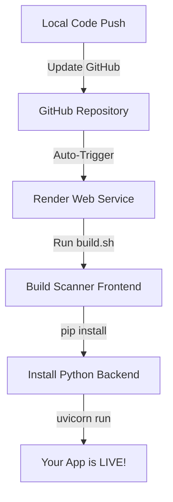

# 🚀 Render Deployment Guide — Business Card Reader (Hindi + English)

Ye document aapko batayega ki kaise apne local project ko **Render** pr live (deploy) krna hai. Render ek popular cloud platform hai jahan aap apna backend aur frontend dono free me host kr skte hain.

---

## 🏗️ 1. Deployment Workflow Kaise Kaam Krta Hai?



---

## 📋 2. Prerequisites (Kya Kya Chahiye)

- **GitHub Account:** Project GitHub pr push hona chahiye (Steps ke liye `SYSTEM_COMPLETE_GUIDE.md` dekhein).
- **Render Account:** [dashboard.render.com](https://dashboard.render.com) pr sign up krein.
- **API Keys Ready:** OpenAI, Google Search, aur Apps Script URL ready rakhein.

---

## 🛠️ 3. Deploy Krne Ka Step-by-Step Tarika

### Step 3.1: Naya Web Service Banayein
1. Render Dashboard me jayein aur **"New +"** pr click krein.
2. **"Web Service"** select krein.
3. Apna GitHub account connect krein aur **`Business_Card_Event_Reader`** repo ko select krein.

### Step 3.2: Basic Configuration
Niche di gayi settings ko sahi se bharein (Ye sabse zaroori hai):

| Field | Value |
|-------|-------|
| **Name** | `business-card-reader` (Aapka pasandida naam) |
| **Region** | `Singapore` (India ke liye best) |
| **Branch** | `main` |
| **Language** | `Python 3` |

### Step 3.3: Build & Start Commands (CRITICAL ⚠️)
Hamara project modular hai, isliye ye commands dhyaan se dalein:

1. **Build Command:**
   ```bash
   chmod +x render-build.sh && ./render-build.sh
   ```
   *(Ye command `BotivateScanner` frontend ko build kregi aur Python libraries install kregi.)*

2. **Start Command:**
   ```bash
   python -m uvicorn backend.main:app --host 0.0.0.0 --port $PORT
   ```

---

## 🔑 4. Environment Variables Setup

Render Dashboard me **"Environment"** tab me jayein aur ye saari keys add krein:

| Key | Value | Notes |
|-----|-------|-------|
| `OPENAI_API_KEY` | `sk-proj...` | Aapki OpenAI Key |
| `GOOGLE_API_KEY` | `AIzaSy...` | Aapki Google Cloud Key |
| `GOOGLE_CSE_ID` | `0441db...` | Aapki Search Engine ID |
| `APPS_SCRIPT_URL` | `https://script.google.../exec` | Google Apps Script URL |
| `PYTHONPATH` | `.` | Python folder path dhoondne ke liye |
| `PYTHON_VERSION` | `3.10.12` | Python version fix krne ke liye |

---

## 📡 5. URL Connection (Frontend + Backend)

Render pr deploy hote hi aapko ek unique URL milega, jaise:
`https://business-card-reader.onrender.com`

**Point to Remember:**
- Is project me backend hi frontend serve krta hai, isliye aapko alag se frontend host krne ki zaroorat nhi hai.
- Aapka **Leads Dashboard** yahan milega: `https://...onrender.com/leads`
- Aapka **Scanner** yahan milega: `https://...onrender.com/scanner`

---

## ❓ 6. Troubleshooting (Agr Deployment Fail Ho)

1. **"ModuleNotFoundError"**: Check krein ki `PYTHONPATH` variable me `.` dala hai ya nhi.
2. **"npm not found"**: Render free tier pr kabhi kabhi npm issue hota hai. Check krein ki Language `Python 3` hi select ki hai (Render Python environment me Node pre-installed rakhta hai).
3. **Timeout Error**: Pehli baar build hone me metadata setup thoda time le skta hai (2-4 mins).
4. **Free Tier Sleep**: Agar aap 15 mins tak app use nhi krenge, to ye 'Sleep' mode me chala jayega. Next time website open krne pr 30 seconds wait krna pdega "Wake up" ke liye.

---

Ab aapka system pure world me kisi ko bhi share krne ke liye ready hai! 🌍🚀
