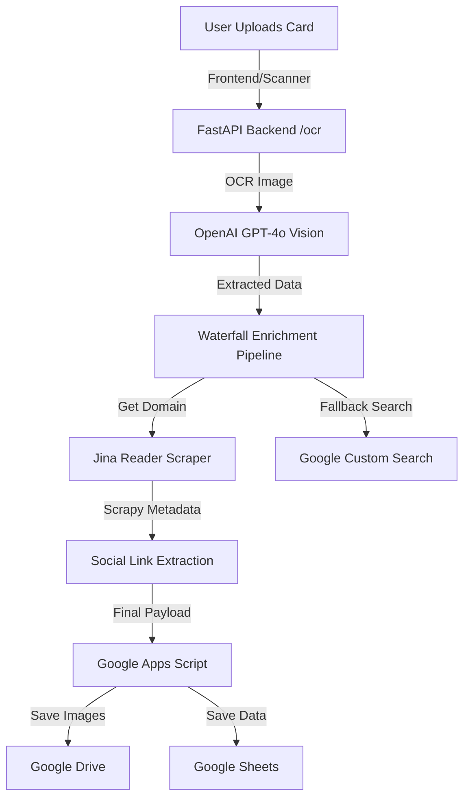

# 📘 Full System Documentation & Setup Guide (Hindi + English)

Ye document is system ko fully setup krne aur uska working flow smjhne ke liye banaya gya hai. Isme system ka har ek part (Backend, Frontend, Apps Script, Database) detail me explain kiya gya hai.

---

## 🏗️ 1. System Overview (Pura System Kaise Kaam Krta Hai)

Ye ek **AI-Powered Business Card Reader** hai. Iska kaam hai business card se data extract krna aur usko enrich (extra info nikalna) krke Google Sheets me save krna.

**Working Flow:**



1.  **Frontend:** User apni business card ki image upload krta hai.
2.  **Backend (FastAPI):** Image ko OpenAI (GPT-4o Vision) ke paas bhejta hai text extract krne ke liye.
3.  **Enrichment:** extracted email se company ki website pata krta hai, fir website scrape krke (Jina API) social media links aur company details nikalta hai.
4.  **Google Apps Script:** Sara data (along with images) Google Sheets me save ho jata hai.
5.  **Dashboard:** `leads.html` page pr sara saved data table format me dikhta hai.

---

## 🛠️ 2. Prerequisites (Zaroori Chije)

Setup shuru krne se pehle ye chije honi chahiye:
- **Python 3.10+** (Install kr lein)
- **Node.js** (Sirf agr React wala scanner build krna ho)
- **OpenAI API Key** (GPT-4o ke liye)
- **Google Cloud API Key & CSE ID** (Search fallback ke liye)
- **Google Account** (Google Sheets aur Apps Script ke liye)

---

## 🚀 3. Installation & Setup (Step-by-Step)

### Step 3.1: Python Environment Setup
1. Repository clone krein: `git clone <repo-url>`
2. Terminal me project folder pe jayein.
3. Virtual environment banayein:
   ```bash
   python -m venv .venv
   .venv\Scripts\activate   # Windows ke liye
   ```
4. Dependencies install krein:
   ```bash
   pip install -r requirements.txt
   pip install -r backend/requirements.txt
   ```

### Step 3.2: Environment Variables (.env)
`backend/` folder ke andar ek `.env` file banayein aur ye keys dalein:
```env
OPENAI_API_KEY=your_openai_key
GOOGLE_API_KEY=your_google_cloud_api_key
GOOGLE_CSE_ID=your_custom_search_id
APPS_SCRIPT_URL=your_google_apps_script_url
```

---

## 📊 4. Google Sheets & Apps Script Setup (Database)

Is system ka database **Google Sheet** hai.

### Step 4.1: Sheet Taiyar Krein
1. Ek nayi Google Sheet banayein.
2. Sheet me niche likhe tabs (pages) banayein (Casing ka dhyan rakhein):
   - `Ai Card` (Main leads ke liye)
   - `Event Details` (Events save krne ke liye)
   - `Event Ai Card` (Event specific leads ke liye)
   - `Visitor Details` (Form se aaye leads ke liye)
   - `Company Profile` (Apni company details ke liye)

### Step 4.2: Apps Script Code Dalein
1. Sheet me **Extensions > Apps Script** pr jayein.
2. Wahan `FINAL_APPS_SCRIPT.js` ka pura code paste kr dein.
3. Code me top pr `SHEET_ID` aur `FOLDER_ID` ko apni sheet aur Google Drive folder ki ID se replace krein.
4. **Deploy** button pr click krein -> **New Deployment**.
5. Select type: **Web App**.
6. Access: **Anyone**.
7. Deploy krne ke baad jo **URL** mile, usko `.env` file me `APPS_SCRIPT_URL` me dal dein.

---

## 📡 5. Data Fetching & Enrichment Logic

System data kaise lata hai?

1.  **GPT-4o OCR:** Pehle image se plain text extract hota hai (Name, Email, Phone).
2.  **Waterfall Enrichment:**
    - Email ka domain (e.g. `@botivate.ai`) nikal kr `botivate.ai` website search krta hai.
    - **Jina Reader API** (`r.jina.ai/url`) ka use krke website ka content fetch krta hai.
    - Fetch hue content se Social Media (Instagram, FB, LinkedIn) links regex se extract hote hain.
    - Agr website nhi milti, to **Google Search** API se company ka data dhunda jata hai.
3.  **Confidence Score:** Data ki reliability ke basis pr 0-100 ka score calculate hota hai.

---

## 🖥️ 6. Frontend Structure

Project me 2 tarah ke frontend hain:
1.  **Vanilla Frontend (`frontend/` folder):** 
    - `index.html`: Main scanner aur upload page.
    - `leads.html`: Dashboard jahan sara data tabular form me dikhta hai.
2.  **React Scanner (`BotivateScanner/` folder):**
    - Ye ek advanced React + Vite app hai jisme live camera scanner hai.
    - Isko use krne ke liye `BotivateScanner` me `npm install` aur `npm run build` krna pdta hai.

---

## ❓ 7. Troubleshooting (Common Issues)

- **"No item with the given ID"**: Check krein ki `SHEET_ID` aur `FOLDER_ID` Apps Script me sahi hain ya nhi.
- **OCR Failed**: Check krein OpenAI key active hai aur usme credits hain.
- **CORS Error**: Backend running hai ya nhi (port 8000).

---

## 📝 Folder Structure Summary

```
Bussiness_Card_Reader/
├── backend/                # FastAPI Logic (Python)
├── frontend/               # UI Files (HTML/JS)
├── BotivateScanner/        # React Camera UI (Vite)
├── .env                    # Secret Keys (OpenAI, Google)
├── FINAL_APPS_SCRIPT.js    # Google Sheets Ka Dimag
└── DOCUMENTATION_AND_SETUP_GUIDE.md  # Ye wala File
```

Ab koi bhi naya person in steps ko follow krke 10-15 minutes me system ready kr skta hai. 🚀
